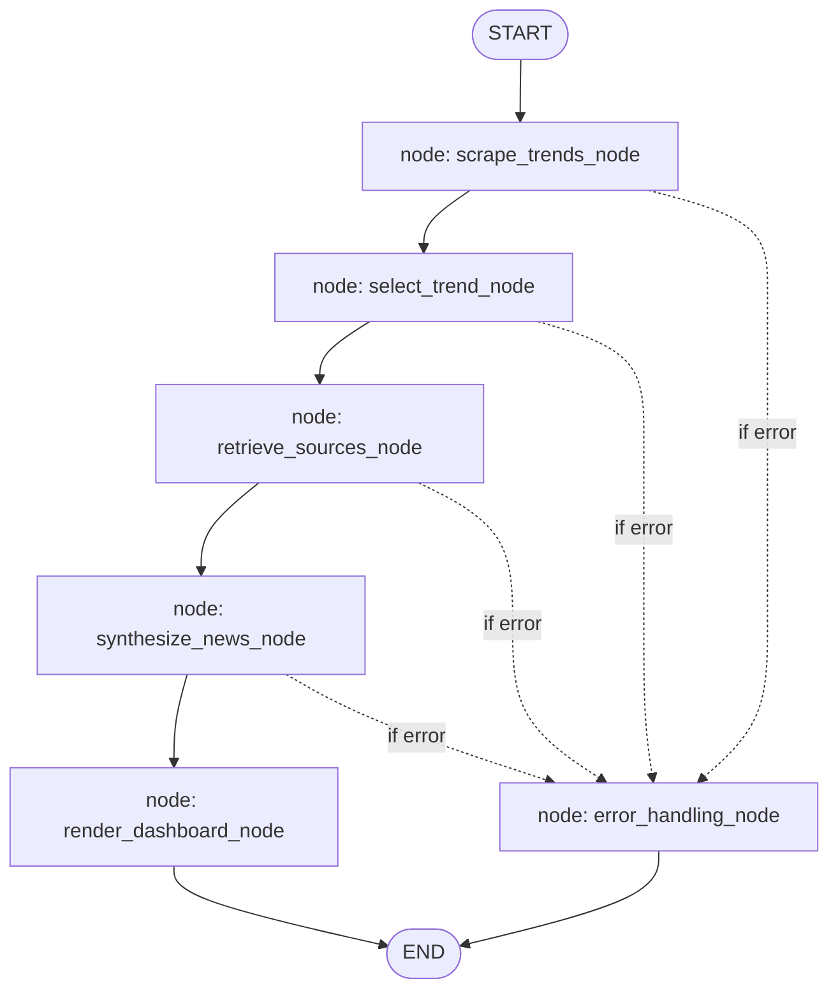

# Agentic X (Twitter) Trend Synthesizer & Dashboard

An intelligent, autonomous agentic system built with LangGraph, LangChain, and Google Gemini that retrieves real-time trending topics, gathers and verifies online news sources, synthesizes factual summaries, and serves them on a modern, high-fidelity interactive dashboard.

---

## ✨ Features

* **Real-time Trend Scraping**: Seamlessly extracts trending topics from global/local channels.
* **Dual-Agent Architecture**:
  1. **Trend Analyzer Agent**: Reviews the hot trends and dynamically selects the most discussion-worthy, factual topic to analyze.
  2. **News Synthesizer Agent**: Aggregates web data, performs factual cross-referencing, drafts a policy-compliant tweet (<280 characters) citing the primary source, and creates a comprehensive brief.
* **Verified News Retriever**: Searches the web to harvest **20+ premium and verified online articles** (e.g., Reuters, TechCrunch, Forbes) with active outbound links.
* **Stateful Orchestration**: Powered by LangGraph, providing robust, fault-tolerant execution with dynamic error interception and routing.
* **Windows Terminal Stability**: Fully reconfigured for UTF-8 standard console outputs to prevent Windows terminal character decoding crashes.
* **Interactive Glassmorphism Dashboard**: Updates a custom local HTML dashboard with premium styling, dark mode, responsive grids, and direct **"Share to X"** Web Intent buttons.

---

## 📐 System Architecture

The synthesizer is engineered around a stateful LangGraph orchestrator, LangChain Gemini agents, dynamic retrievers, and a local storage engine.



### Architectural Components:
1. **Stateful Orchestration Layer (`agent_orchestrator.py`)**: Utilizes LangGraph to model execution as a directed state graph. If any step fails, conditional edges gracefully route to an error-handling node, preventing unexpected crashes.
2. **Scraping Layer (`trend_analyzer.py`)**: Fetches current raw hot topics from scraping channels. Parses raw UTF-8 bytes to safely extract international characters (e.g., Japanese, Hindi).
3. **LangChain Trend Analyzer (`trend_analyzer.py`)**: Analyzes the raw trend list and employs Gemini 2.5/1.5 to choose a suitable topic based on factual depth and verifiability.
4. **Verified Source Retriever (`source_retriever.py`)**: Uses DuckDuckGo standard text queries to harvest up to 25+ real-time web articles from premium publishers, bypassing standard API constraints.
5. **LangChain News Synthesizer (`news_synthesizer.py`)**: Reviews article snippets, filters bias/contradictions, compiles a structured factual brief, and drafts an engaging, compliant tweet (< 280 chars) citing the verified source URL.
6. **Storage & Presentation Layer (`dashboard_renderer.py` / `history.json`)**: Appends run data to a historical sequence, then compiles it into a beautiful glassmorphism local HTML page (`dashboard.html`) complete with dynamic stats, a chronological timeline, and one-click "Share to X" Web Intent integration.

---

## 🛠️ Installation

1. **Clone the Repository**:
   ```bash
   git clone https://github.com/vikrammaditya/twitter-trend-synthesizer.git
   cd twitter-trend-synthesizer
   ```

2. **Install Dependencies**:
   ```bash
   pip install -r requirements.txt
   ```

3. **Configure Environment Variables**:
   * Copy the template file:
     ```bash
     cp .env.template .env
     ```
   * Open `.env` and fill in your details (like `GEMINI_API_KEY`):
     ```ini
     GEMINI_API_KEY=AIzaSy...
     TRENDS_LOCATION=global
     CHECK_INTERVAL_HOURS=2
     MAX_SOURCES=25
     ```

---

## 🚀 Usage

### 1. Run Now (Immediate Execution)
Execute a one-off cycle to scrape current trends, search the web, compile a news digest, and update the dashboard:
```bash
python app.py --run-now
```

### 2. Run background Scheduler
Run the background scheduler to automatically check, analyze, and post trending updates every few hours:
```bash
python app.py
```

### 3. Open the Premium Dashboard
Simply open the generated `dashboard.html` file in any web browser to view your runs, read synthesized reports, browse verified sources, and share drafted posts to X with a single click.

---

## 🛡️ Security

This repository is strictly **code-only**. The local databases (`history.json`), customized API keys (`.env`), scraped logs, and dashboard render outputs (`*.html`) are isolated via `.gitignore` to prevent any credential exposure.
